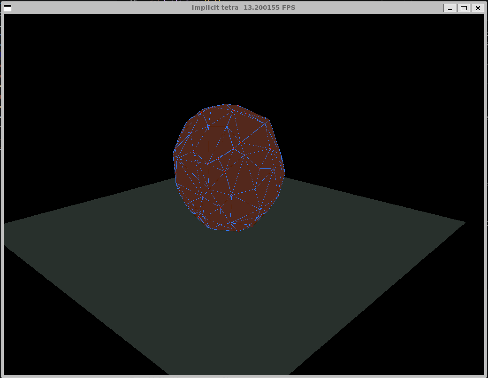
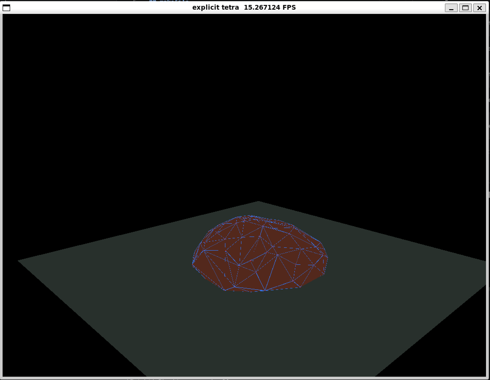

## requirements:

taichi scipy numpy

## makefile

```
make tet
```

to generate ball meshes

```
make explicit
```

to run explicit euler simulation

```
make implicit
```

to run implicit euler simulation

```
make experiment
```

to run experiment

## demo



